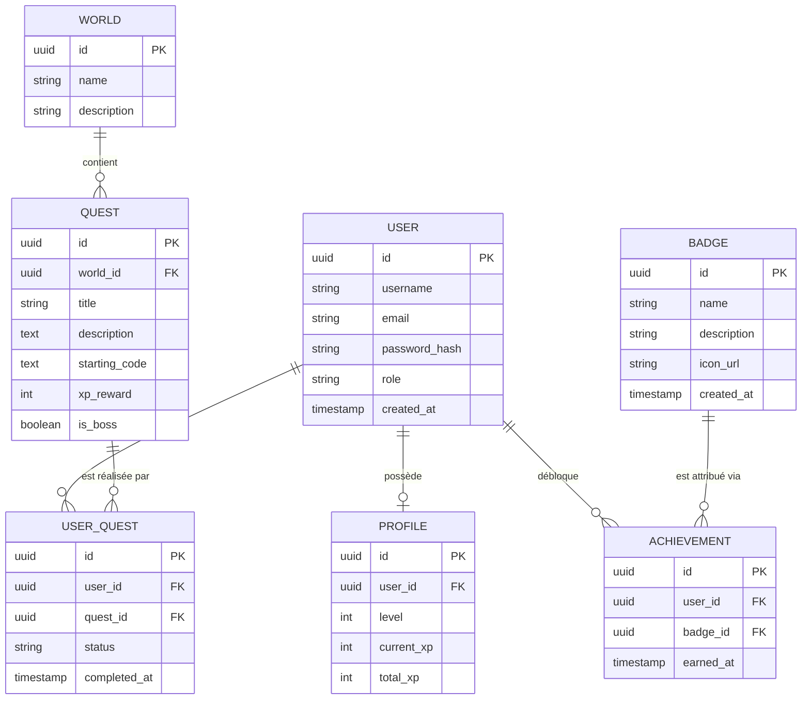

# Base de données - CodeQuest

## Diagramme de la base

## Entités

- **User** : Représente un compte utilisateur sur la plateforme avec ses informations de connexion et son identité.
- **Profile** : Contient les informations de progression de l'utilisateur (niveau actuel, points d'expérience en cours et total accumulé).
- **World** : Représente une technologie ou un domaine d'apprentissage spécifique (Java, Spring Boot, Git, Docker, etc.).
- **Quest** : Définition d'un défi ou d'un exercice technique avec son contexte, le code source initial, la récompense en XP et un indicateur si la quête est un boss.
- **UserQuest** : Table de liaison qui stocke l'état d'avancement (en cours, validée, échouée) d'une quête pour un utilisateur donné.
- **Badge** : Définition d'un succès ou d'une récompense visuelle (nom, description, icône).
- **Achievement** : Table de liaison enregistrant l'obtention d'un Badge par un User à une date donnée.

## Relations

- Un utilisateur (**User**) possède un et un seul profil de progression (**Profile**).
- Un monde (**World**) regroupe une ou plusieurs quêtes (**Quest**).
- Une quête (**Quest**) appartient obligatoirement à un seul monde (**World**).
- Un utilisateur (**User**) peut participer à plusieurs quêtes (**Quest**), l'historique étant tracé par **UserQuest**.
- Une quête (**Quest**) peut être tentée et résolue par de multiples utilisateurs (**User**).
- Un utilisateur (**User**) peut débloquer plusieurs succès (**Achievement**), chacun étant lié à un badge spécifique (**Badge**).
